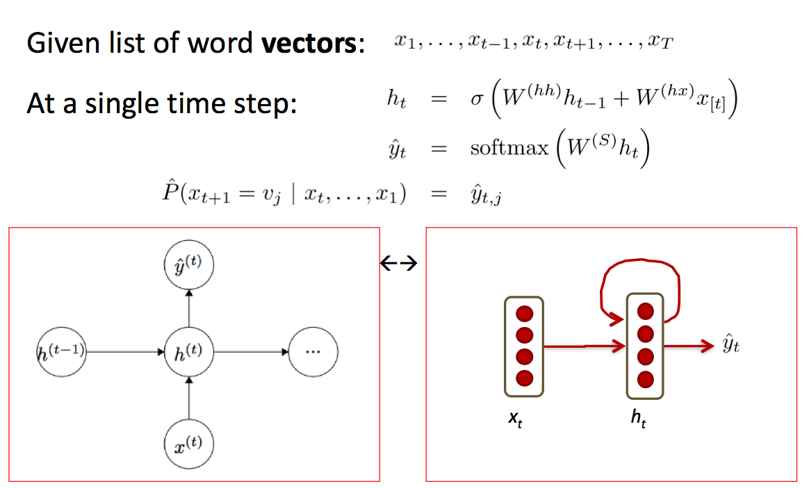
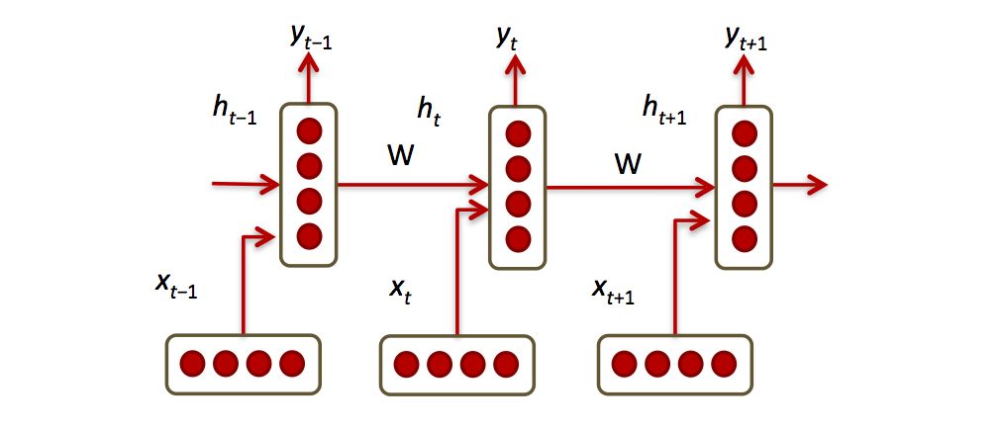
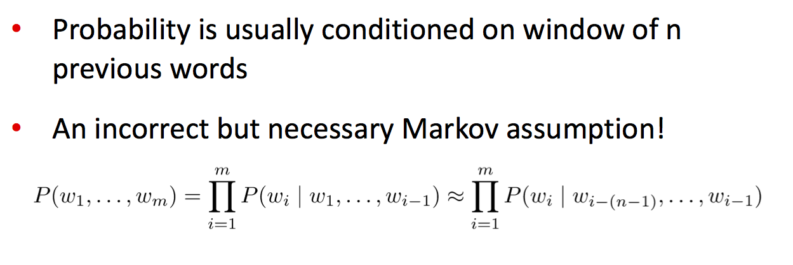
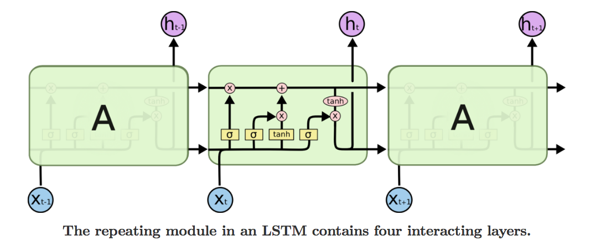

# learn-RecurrentNN

## 1. Recurrent neural net的结构

与basic neural net相比，每一层Recurrent neural net有额外的输入，也有额外的输出。

一般的，h(t-1)是输入，h(t)是输出，在这里，额外的输入是x(t-1)，额外的输出是y(t-1).

不同hidden layer之间的变换矩阵W是相同的，相同的W表征着word之间的一样的有先有后的相邻关系。

正是相同的W，也产生了gradient explode和gradient vanish的问题（如果没有activation layer，多层相同的W意味着W的n次幂，所以会有gradient explode和gradient vanish，即使有activation layer，也还是会有同样的问题），如果W很大，back pass中计算gradient时得到的偏导数就会很大，影响gradient descent的收敛，如果W很小，back pass中计算gradient时得到的偏导数就会很小，gradient descent过程就会收敛的很慢。

还有Long-Term Dependencies的问题：

Sometimes, we only need to look at recent information to perform the present task. For example, consider a language model trying to predict the next word based on the previous ones. If we are trying to predict the last word in “the clouds are in the sky,” we don’t need any further context – it’s pretty obvious the next word is going to be sky. In such cases, where the gap between the relevant information and the place that it’s needed is small, RNNs can learn to use the past information.

But there are also cases where we need more context. Consider trying to predict the last word in the text “I grew up in France… I speak fluent French.” Recent information suggests that the next word is probably the name of a language, but if we want to narrow down which language, we need the context of France, from further back. It’s entirely possible for the gap between the relevant information and the point where it is needed to become very large.

Unfortunately, as that gap grows, RNNs become unable to learn to connect the information.

In theory, RNNs are absolutely capable of handling such “long-term dependencies.” A human could carefully pick parameters for them to solve toy problems of this form. Sadly, in practice, RNNs don’t seem to be able to learn them. 

Thankfully, LSTMs don’t have this problem!

另外，因为cell state的加入，LSTM没有gradient vanish的问题，但是还是会有gradient explode的问题，所以会给gradient设一个threshold，如果gradient超过threshold的话，就把gradient设成该threshold.

## 2. The probability of a sequence of words

预测The probability of a sequence of words，在两个方面有用，一是自动翻译方面，不同的语言词序不同，二是语音识别方面，同音字到底选取哪个要看整个句子。

上面的markov模型其实就是语言学中常说的n-gram model. 在n-gram model中，句子中的每个单词的概率的计算只是由前面几个单词决定的。如果拟合LSTM来做计算的话，每次要看的sequence不一定要很长，固定长度就可以了，如果没有这个假设的话，预测时每次都要把前面所有词囊括进来的话，不管做forward pass还是back pass，计算量都太大了。

The probability of a sequence of words转化为已知一组单词，预测下一个单词是某个具体单词的概率。

RAM requirement scales with number of words. 预测下一个单词时，一组单词的所有信息都包含在之前一个neuron当中，所以，内存只需要保存之前一个neuron的信息，所需的内存有限。

## 3. Comparison with other neural networks

可以认为，RecurrentNN是一种实用的Tree recursive neural network，包含着specific assumption。

对于RecurrentNN，可能没有额外的输出y(t-1)，但是在结构上，都是每次加入一个新的neuron。在自然语言处理方面，就是每次加入一个word，或者每次加入一个字。

## 4. References

[Understanding LSTM Networks](http://colah.github.io/posts/2015-08-Understanding-LSTMs/)

## 5. Function and application

1. RecurrentNN常用来产生text，也就是用机器来自动写文章，自动翻译
2. 也可以用机器来自动生产图片（模仿其他图片，避开侵权），比如使用最新的deep learing技术Generative adversarial networks (GANs)

## 6. LSTM (long short term memory)

Long Short Term Memory networks – usually just called “LSTMs” – are a special kind of RNN, capable of learning long-term dependencies.

LSTMs are explicitly designed to avoid the long-term dependency problem. Remembering information for long periods of time is practically their default behavior, not something they struggle to learn!

LSTMs also have this chain like structure, but the repeating module has a different structure. Instead of having a single neural network layer, there are four, interacting in a very special way.

其中的sigmoid function充当forget gate的作用，很多值会被压缩成接近0，然后与一个矩阵element-wise相乘时，该矩阵的部分元素就被过滤了，通过舍弃一部分信息，强化剩余的信息。

LSTM中cell state的计算相对简单，就是一乘一加，hidden state的计算相对复杂，有多个gate参与计算。

The key to LSTMs is the cell state, the horizontal line running through the top of the diagram.

The cell state is kind of like a conveyor belt. It runs straight down the entire chain, with only some minor linear interactions. It’s very easy for information to just flow along it unchanged.

The LSTM does have the ability to remove or add information to the cell state, carefully regulated by structures called gates.

Gates are a way to optionally let information through. They are composed out of a sigmoid neural net layer and a pointwise multiplication operation.

The sigmoid layer outputs numbers between zero and one, describing how much of each component should be let through. A value of zero means “let nothing through,” while a value of one means “let everything through!”

An LSTM has three of these gates, to protect and control the cell state.

Earlier, I mentioned the remarkable results people are achieving with RNNs. Essentially all of these are achieved using LSTMs. They really work a lot better for most tasks!

## 7. LSTM的实际应用

对于character-wise RNN with LSTMs (CharRNN)，使用多层LSTM作为hidden layer（前一层LSTM的输出是后一层LSTM的输入），每一层hidden layer也包括多个LSTM，这多个LSTM作为softmax的输入，然后得到softmax的输出，预测最可能是哪个character.

batch_size就是这个batch中包括多少个sequence，num_steps表示每个sequence的长度是多少，所以characters_per_batch就是上面二者的乘积，batch的批数就是文本的总的长度除以characters_per_batch。

在最初试验的时候，经常取batch_size=1，num_steps=1.

lstm_size是每个hidden layer单元包括多少个LSTM，num_layers表示hidden layer中使用多少层LSTM，num_classes表示softmax输出的种类个数。对于RNN (CharRNN)的output layer，是一个fully connected network，weights的维度是lstm_size*num_classes，最后的activation function用的是softmax function.

输入Xt其实是一个多维的向量，比如one-hot vector或者word embedding，lstm构成的hidden layer其实是有深度的，这个深度就是lstm_size，从Xt到hidden layer也是有一个weight来做线性变换的（其实是4个不同的weight，但它们的维度是一样的），如果Xt的维度是n，那么这个weight的维度是n * lstm_size.如果一层lstm之后是另一层lstm，此时上一层的lstm的ht就充当下一层的lstm的Xt，如果两层lstm的深度都是lstm_size的话，两层之间的weight的维度就是lstm * lstm_size（也是4个不同的weight，但维度是一样的）。

实际上，从Xt到hidden layer的变换，输入除了Xt，还有h(t-1)，具体操作时，是把Xt，h(t-1)两个向量合并，然后再做线性变换。

从Cell state的C(t-1)到Ct的计算，是不做线性变换的，也就是并不需要乘以一个weight矩阵。正是因为不需要乘以weight，It’s very easy for information to just flow along it unchanged. 在求解gradient时，正是因为不需要weight的cell state的存在，普通RNN所碰到的问题才能得到解决。

## 8. Neural net, CNN, RNN三者的区别

Neural net可以类比为集合set，各个feature之间是独立的，没有先后顺序，也没有相邻关系，CNN可以类比为双向链表，feature之间有相邻关系（左右相邻、上下相邻等），但没有先后顺序，RNN可以类比为单向链表list，feature之间有先后顺序。

图像的像素之间只有相邻关系，没有先后顺序，把图像转过来、倒过来都还是一样的图，但是，对于语音和文字语言，是有先后顺序的，倒背或者倒写完全不可理解。所以RNN比CNN处理自然语言有更大的优势，但是CNN也有一定的作用，和普通的Neural net相比，至少抓住了词与词之间的相邻关系。
